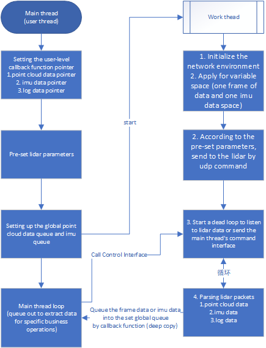

# 2 Thread model

## Overview

Describe the flow of the entire driver operation and the precautions to be taken.

With the demos in the samples folder, you can see that the overall control is realized through a singleton class PaceCatLidarSDK.

Overall thread structure: main thread + worker threads
The main thread can be understood as the thread in which the client is integrated, specifically creating the PaceCatLidarSDK class and calling the class interface.

The worker thread can be understood as the thread that receives the packets transmitted by the lidar in real time, parses them, and returns the data to the customer through the callback function.

It should be noted that: the callback function is set by the user, every time the PaceCatLidarSDK class parses a frame of data/imu/log information, it triggers the callback, which returns a frame of data pointer, which is created and canceled internally by the class itself, and the user can only deep copy the pointer data into the user queue. Specific integration calls can refer to PointCloudAndImu.cpp, here the use of third-party libraries of the queue, in the sub-thread callbacks will be stored in the queue, the main thread through the queue to extract the data for other operations. If the user uses other queue wheel, directly replace the CUSTOM_WHELL macro definition code block can be ok.
