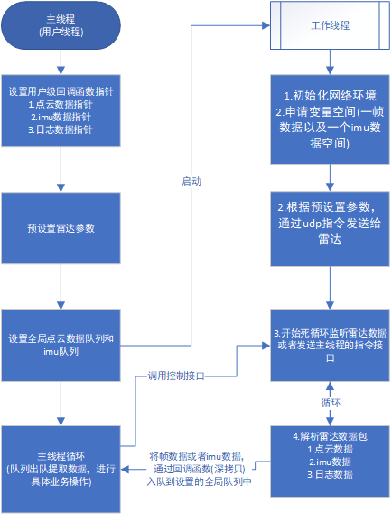

# 2 线程模型

## 概述

描述整个驱动的运行流程以及注意事项。

通过samples文件夹中的demo，可以看到整体控制是通过一个单例类PaceCatLidarSDK来实现的。

整体线程结构:主线程+工作线程
主线程可以理解为客户集成时所在的线程，具体创建PaceCatLidarSDK类，并调用该类接口。

工作线程可以理解为实时接收雷达传输的数据包，并解析，通过回调函数将数据返回给客户。

这里需要说明的是:由用户设置回调函数，在每次PaceCatLidarSDK类解析出一帧数据/imu/日志信息的时候，都会触发回调，会返回一帧的数据指针，该指针由类内部自行创建与取消，用户仅能将该指针数据深拷贝到用户队列中。具体集成调用可以参考 PointCloudAndImu.cpp，这里使用了第三方库的队列，在子线程回调中将数据存到队列中，主线程中通过队列提取到数据，进行其他操作。如果用户使用其他队列库，直接将CUSTOM_WHELL宏定义代码块替换即可.
